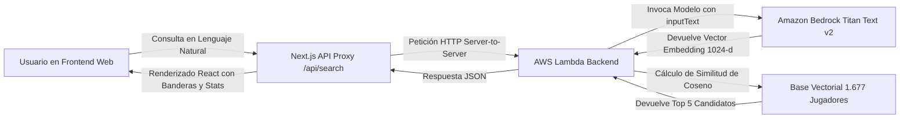

# 📖 Guía de Funcionalidad · Scout AI
> **Plataforma de Inteligencia Táctica y Scouting Semántico con Amazon Bedrock**  
> *Documento técnico y funcional descriptivo de la aplicación web.*

---

## 1. 🎯 ¿Qué es Scout AI?

**Scout AI** es una solución integral diseñada para directores deportivos, analistas de rendimiento y secretarías técnicas de clubes de fútbol. Permite buscar y descubrir jugadores idóneos para un modelo de juego específico utilizando **lenguaje natural y descriptivo**, en lugar de requerir filtros rígidos de bases de datos tradicionales.

A diferencia de los buscadores habituales donde solo se puede filtrar por *"Edad < 25 AND Goles > 5"*, con Scout AI el analista puede redactar solicitudes como:

> *"Centrocampista 'box-to-box' con gran capacidad para romper líneas mediante pase progresivo, con alta intensidad en la presión y recuperación en campo contrario similar a Rodri."*

La plataforma interpreta la semántica futbolística de la petición y localiza los futbolistas más afines en cuestión de segundos.

---

## 2. 🏗️ Arquitectura y Flujo de Datos



### Pasos del flujo:
1. **Entrada de consulta:** El usuario escribe o selecciona un arquetipo táctico.
2. **Cero problemas de CORS:** La petición viaja internamente a `/api/search` (Next.js API Route), la cual actúa como pasarela segura hacia AWS.
3. **Incrustación Vectorial (Embedding):** AWS Lambda envía el texto a **Amazon Bedrock**, invocando el modelo fundacional `amazon.titan-embed-text-v2:0` para transformarlo en un vector numérico de 1.024 dimensiones.
4. **Cálculo de similitud:** La función Lambda calcula el producto escalar (similitud de coseno) entre el vector de búsqueda y los 1.677 perfiles vectorizados previamente.
5. **Ranking y entrega:** Se seleccionan los 5 candidatos con mayor puntuación y se envían a la interfaz.
6. **Enriquecimiento en cliente:** El frontend extrae métricas de rendimiento, enlaza banderas oficiales mediante CDN y presenta las tarjetas con el anillo de compatibilidad táctica.

---

## 3. 🖥️ Módulos y Funcionalidades de la Interfaz

### 3.1. Encabezado Táctico (Header)
- **Identidad de marca:** Logotipo de Scout AI con estilo visual moderno y minimalista.
- **Indicador de estado en tiempo real:** Insignia *"Titan Embeddings Live"* con un pulso verde esmeralda que confirma la conectividad con la infraestructura de Amazon Bedrock en AWS.
- **Navegación:** Enlaces directos a las secciones de búsqueda, comparativas y generación de informes.

---

### 3.2. Buscador Táctico en Lenguaje Natural (Hero Section)
- **Área de texto responsiva:** Permite escribir descripciones largas y detalladas sin restricciones de longitud.
- **Soporte de tecla rápida:** Al pulsar `Enter` se lanza la búsqueda de inmediato (utilizando `Shift + Enter` para saltos de línea).
- **Control de estado:** El botón *"Find Candidates"* gestiona estados deshabilitados cuando el campo está vacío o durante el procesamiento de la consulta.

---

### 3.3. Arquetipos Tácticos Rápidos (Quick Prompts)
Junto a la barra de búsqueda se encuentran accesos directos a arquetipos modernos del fútbol europeo:
- **Pivote Organizador:** *"Box-to-box midfielder similar to Rodri with line-breaking passes"*
- **Extremo Dinámico:** *"Pacey left winger strong in 1v1 duels and chance creation"*
- **Guardameta Dominante:** *"Dominant goalkeeper with high save percentage and aerial command"*
- **Central Moderno:** *"Ball-playing center back composed under pressure with high duel win rate"*

Un solo clic en cualquiera de estos chips ejecuta la búsqueda automáticamente.

---

### 3.4. Tarjetas de Jugadores (Player Recommendation Cards)
Cada futbolista recomendado se presenta en una tarjeta táctica avanzada con las siguientes características:

#### 1. Iluminación fija al pasar el ratón (Hover Glow)
Al colocar el cursor sobre una tarjeta, el borde exterior se ilumina suavemente en tono esmeralda (`rgba(16, 185, 129, 0.75)`) acompañado de una sombra ambiental fija y una elevación de 4px, permitiendo enfocar la atención sin parpadeos molestos.

#### 2. Sistema de Banderas de Alta Resolución (Flagcdn)
Para evitar problemas de renderizado en navegadores y sistemas operativos de escritorio como Windows (donde los emojis de banderas aparecen en blanco y negro o caracteres corruptos), la aplicación integra un sistema CDN que descarga la bandera oficial en formato vectorial/PNG nítido:
- Presente en el avatar del futbolista.
- Presente en la píldora informativa de nacionalidad junto al código FIFA (ej. `ESP`, `CRO`, `FRA`, `ARG`).

#### 3. Anillo de Compatibilidad Táctica (Match Ring)
Un gráfico circular animado mediante SVG que muestra el porcentaje de afinidad con la búsqueda (de 65% a 99%):
- **Verde Esmeralda (≥85%):** Compatibilidad táctica excepcional.
- **Teal / Cian (75% - 84%):** Alta compatibilidad táctica.
- **Azul Cielo (<75%):** Perfil compatible con roles complementarios.

#### 4. Etiquetas de Datos y Similitud
- **Posición táctica:** `MF` (Centrocampista), `FW` (Delantero), `DF` (Defensa), `GK` (Portero).
- **Edad:** Años del jugador.
- **Club y Liga:** Nombre del club y competición doméstica en la que milita (La Liga, Premier League, Serie A, etc.).
- **Similitud Matemática:** Porcentaje exacto de similitud de coseno calculado por el motor vectorial.

#### 5. Resumen Táctico de IA Generativa
Extracto narrativo generado a partir de las estadísticas avanzadas del jugador, detallando minutaje, participación en goles, disparos a puerta, intercepciones y rigor defensivo.

#### 6. Barras de Estadísticas Clave (Key Stats)
Visualización gráfica de barras de progreso dinámicas adaptadas según el rol del jugador:
- **Jugadores de campo:** Goles, asistencias, recuperaciones de balón / intercepciones.
- **Porteros:** Paradas totales, porcentaje de paradas y porterías a cero.

#### 7. Botón de Informe Completo
Permite abrir la ficha técnica extendida del jugador con el desglose pormenorizado para el analista.

---

### 3.5. Estados de Carga y Resiliencia (Loading & Error States)
- **Pantalla de carga (Radar Vectorial):** Mientras AWS Bedrock y Lambda calculan los vectores, la aplicación muestra una animación de radar esmeralda con esqueletos visuales (*skeletons*) que evitan saltos de diseño.
- **Manejo de errores:** Si se produce un fallo de red o tiempo de espera, la interfaz despliega un mensaje claro con botón de *"Retry Search"* para reintentar la operación con un solo clic.

---

## 4. 🚀 Cómo Ejecutar la Aplicación

### Requisitos previos
- Node.js versión 18 o superior.
- Conexión a Internet (para conectar con la API de AWS y la CDN de banderas).

### Comandos de ejecución
1. **Instalación de dependencias:**
   ```bash
   npm install
   ```
2. **Modo Desarrollo:**
   ```bash
   npm run dev
   ```
   Abre [http://localhost:3000](http://localhost:3000) en tu navegador.

3. **Compilación para Producción:**
   ```bash
   npm run build
   npm run start
   ```

---

## 5. 💡 Conclusión y Valor Diferencial para el Hackathon
Scout AI combina de forma efectiva:
- **Amazon Bedrock (Titan Text Embeddings v2):** Comprensión semántica del lenguaje y las características deportivas complejas.
- **AWS Lambda:** Ejecución rápida, sin servidor y escalable para consultas vectoriales.
- **Next.js & React:** Una experiencia de usuario moderna, fluida y con nivel de diseño profesional para el sector futbolístico de élite.
