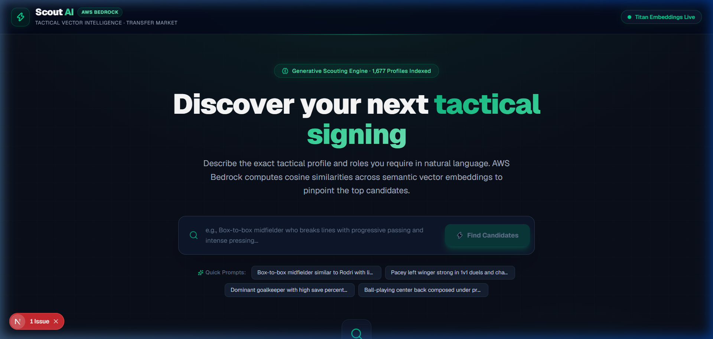
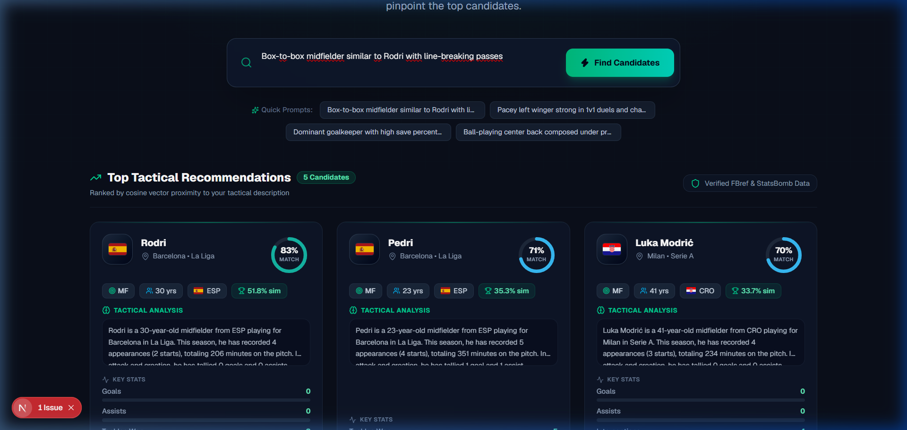
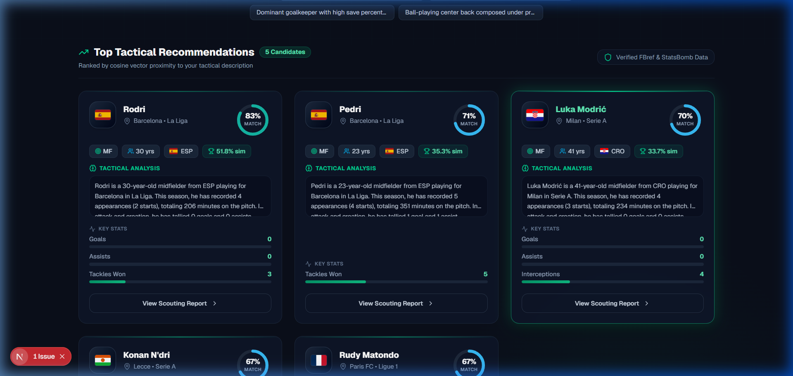

# Scout AI · Tactical Intelligence for Football Transfers
> **AWS Hackathon 2026** · AI-powered tactical scouting and player recommendation platform using natural language semantic search with Amazon Bedrock.

[](https://nextjs.org/)
[](https://react.dev/)
[](https://aws.amazon.com/bedrock/)
[](https://aws.amazon.com/lambda/)
[](https://tailwindcss.com/)
[](https://www.typescriptlang.org/)

---

## Table of Contents
- [Overview](#overview)
- [UI Screenshots](#ui-screenshots)
- [System Architecture](#system-architecture)
- [Key Features](#key-features)
- [Repository Structure](#repository-structure)
- [Installation and Setup](#installation-and-setup)
- [Data & Embeddings Pipeline](#data--embeddings-pipeline)
- [AWS Lambda & Bedrock Configuration](#aws-lambda--bedrock-configuration)
- [Additional Documentation](#additional-documentation)

---

## Overview

**Scout AI** is an advanced sports analytics and tactical scouting platform designed for sporting directors, technical secretariats, and recruitment analysts. It enables discovering football players using **free-form natural language descriptions**, eliminating the constraints of rigid database filters.

Instead of relying solely on traditional hard metrics (*"Age < 25 AND Goals > 5"*), analysts can query nuanced tactical archetypes:

> *"Box-to-box midfielder similar to Rodri with line-breaking passes, high duel win rate and defensive composure"*

The system transforms the tactical description into a semantic embedding via **Amazon Bedrock (Titan Text Embeddings v2)** and computes real-time **cosine similarity** across a vector dataset of **over 1,670 professional football players**, returning the highest-fit recommendations in under 2 seconds.

---

## UI Screenshots

### 1. Natural Language Tactical Search
Dark tactical dashboard featuring real-time Amazon Bedrock status monitoring and one-click quick archetype prompts:



---

### 2. Semantic Results & Tactical Ranking
Cosine proximity rankings with mathematical similarity scores, position tags, club, and league details:



---

### 3. Tactical Player Cards
Interactive player cards with animated **tactical match rings**, high-resolution national flags powered by **Flagcdn**, AI-generated analytical summaries, role-based key metrics, and a **steady emerald glow hover effect**:



---

## System Architecture

```text
+------------------------------------------------------------------------------------+
|                         Frontend Layer (Next.js 16 + React 19)                     |
|                                                                                    |
|   [ Tactical Search Dashboard ]                                                    |
|             |                                                                      |
|             |  1. Free-form Tactical Query                                         |
|             v                                                                      |
|   [ Next.js API Route Proxy (/api/search) ]                                        |
+------------------------------------------------------------------------------------+
                                       |
                                       | 2. Server-to-Server HTTPS Request (No CORS)
                                       v
+------------------------------------------------------------------------------------+
|                         AWS Cloud Infrastructure (us-east-1)                       |
|                                                                                    |
|   [ AWS Lambda Function: scout-ai-backend (Python 3.12) ]                          |
|             |                                       |                              |
|             | 3. Invoke Model (boto3)               | 5. Vector Dot Product /      |
|             v                                       |    Cosine Similarity         |
|   [ Amazon Bedrock ]                                v                              |
|     Model: amazon.titan-embed-text-v2:0    [ In-Memory Vector Store ]              |
|     Generates: 1024-d Normalized Vector      1,677 Players (1024-d Embeddings)     |
|             |                                       |                              |
|             +-------------------> [ Top 5 Candidates ]                             |
|                                                     |                              |
+------------------------------------------------------------------------------------+
                                       |
                                       | 6. Ranked JSON Response
                                       v
                     [ Client Card Render with Flagcdn & Match Rings ]
```

### Data Flow Breakdown
1. **User Query Input**: The analyst types a descriptive prompt or selects a quick archetype chip.
2. **Next.js API Proxy (`/api/search`)**: Acts as a secure server-to-server gateway, bypassing browser cross-origin (CORS) preflight restrictions.
3. **Embedding Generation**: AWS Lambda invokes `amazon.titan-embed-text-v2:0` in Amazon Bedrock, producing a normalized 1,024-dimensional vector.
4. **Vector Similarity Ranking**: Cosine proximity is computed against the 1,677 pre-indexed player profiles.
5. **Client Presentation**: The frontend enriches the results with tactical affinity rings, role-specific metrics, and high-definition national flags.

---

## Key Features

- **Semantic Search with Amazon Bedrock**: Deep context understanding through 1024-dimensional embeddings.
- **Fast Response Latency (<2s)**: Serverless AWS Lambda execution tuned with 512 MB RAM and 30-second timeout.
- **Flagcdn Integration**: Crystal-clear vector/PNG flags for 98+ countries, overcoming Windows emoji rendering limitations.
- **Tactical Match Ring**: Visual percentage affinity badge (85%+ Emerald, 75%-84% Cyan, <75% Blue).
- **Steady Glow Hover Effect**: Refined emerald border illumination and elevation without visual flickering.
- **Adaptive Key Metrics**: Dynamic progress bars customized by role (goals/assists/tackles for outfielders vs. saves/clean sheets for goalkeepers).
- **Resilient UI States**: Interactive radar loader during Bedrock computation and one-click retry fallback.

---

## Repository Structure

```text
scout-ai/
├── app/
│   ├── api/
│   │   └── search/
│   │       └── route.ts              # API Route Proxy (Next.js -> AWS Lambda)
│   ├── data/
│   │   ├── jugadores_stats.csv       # Original statistics dataset
│   │   ├── perfiles_procesados.json  # 1,677 generated narrative profiles
│   │   ├── perfiles_con_vectores.json# Profiles with 1024-d Bedrock embeddings
│   │   └── mockPlayers.ts            # Fallback mock data for offline work
│   ├── scripts/
│   │   ├── process_players.py        # Data cleaning and narrative profile generator
│   │   ├── generate_vectors.py       # Embedding generation pipeline via Boto3
│   │   └── generar_vectores.py       # Spanish predecessor script
│   ├── globals.css                   # Custom CSS tokens and steady hover glow rules
│   ├── layout.tsx                    # Root layout with font optimization
│   └── page.tsx                      # Main interactive tactical dashboard
├── docs/
│   └── screenshots/                  # High-resolution application screenshots
│       ├── hero-search.png
│       ├── search-results.png
│       └── player-cards.png
├── public/
│   └── screenshots/                  # Public asset mirror served by Next.js
├── DIARIO_DE_PROYECTO.md             # Chronological project development log
├── FUNCIONALIDAD_WEB.md              # Functional specification guide
├── package.json                      # Next.js dependencies and script definitions
├── tsconfig.json                     # Strict TypeScript configuration
└── .gitignore                        # Git exclusion rules
```

---

## Installation and Setup

### Prerequisites
- **Node.js** v18.18+ (v20+ recommended)
- **npm** v9+
- Active internet connection (for AWS Lambda endpoints and Flagcdn assets)

### Setup Steps

1. **Clone the repository:**
   ```bash
   git clone https://github.com/Mamarco13/scout-ai.git
   cd scout-ai
   ```

2. **Install dependencies:**
   ```bash
   npm install
   ```

3. **Start the local development server:**
   ```bash
   npm run dev
   ```

4. **Access the application:**
   Open [http://localhost:3000](http://localhost:3000) in your browser.

### Available Scripts

| Command | Action |
| :--- | :--- |
| `npm run dev` | Runs the Next.js development server at `http://localhost:3000` |
| `npm run build` | Builds the production bundle with strict TypeScript validation |
| `npm run start` | Launches the production-optimized Next.js server |
| `npm run lint` | Runs ESLint to verify codebase standards |

---

## Data & Embeddings Pipeline

The [`app/scripts`](app/scripts/) directory contains the data engineering pipeline used to populate the vector dataset:

### 1. Data Cleaning & Profile Generation (`process_players.py`)
- Ingests raw football performance data from `jugadores_stats.csv`.
- Automatically identifies delimiters (`csv.Sniffer`) and filters players by regular playing time (`Matches Played >= 10`).
- Produces a structured tactical narrative profile (`text_profile`) summarizing role, age, league, playing minutes, attacking output, and defensive metrics.
- Exports 1,677 validated player entries into `perfiles_procesados.json`.

### 2. Bedrock Vectorization Pipeline (`generate_vectors.py`)
- Reads each `text_profile` and connects to the AWS Bedrock Runtime client in `us-east-1`.
- Calls `amazon.titan-embed-text-v2:0` requesting normalized **1,024-dimensional** embeddings.
- Saves the computed vectors into `perfiles_con_vectores.json` for ingestion by the serverless Lambda backend.

---

## AWS Lambda & Bedrock Configuration

- **Foundation Model:** `amazon.titan-embed-text-v2:0`
- **AWS Region:** `us-east-1` (N. Virginia)
- **Lambda Function:** `scout-ai-backend` (Python 3.12)
- **Execution Settings:**
  - **Memory:** 512 MB
  - **Timeout:** 30 seconds
  - **Cold Start Latency:** Mitigated to ~1.5s - 1.8s
- **Endpoint URL:** Integrated seamlessly via the internal `/api/search` proxy route.

---

## Additional Documentation

- [Project Development Log (`DIARIO_DE_PROYECTO.md`)](DIARIO_DE_PROYECTO.md): Comprehensive chronological record of requirements, CORS troubleshooting, build fixes, and latency tuning.
- [Web Functional Guide (`FUNCIONALIDAD_WEB.md`)](FUNCIONALIDAD_WEB.md): Functional specification detailing UI components, interaction design, and system behaviors.
